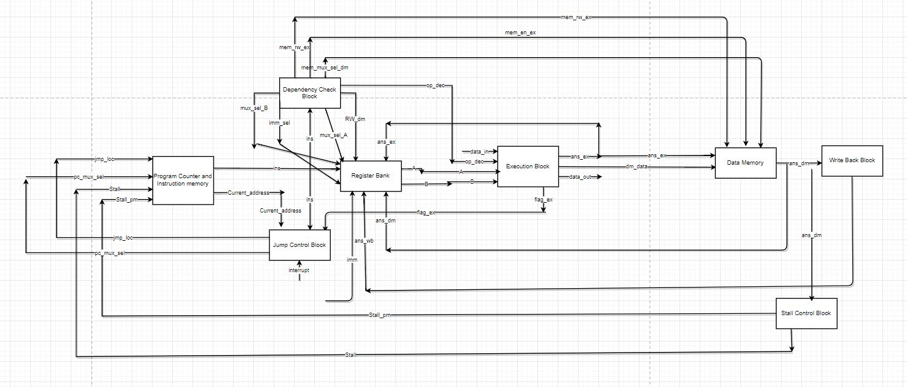
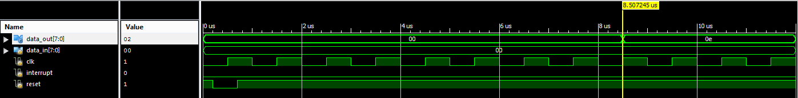
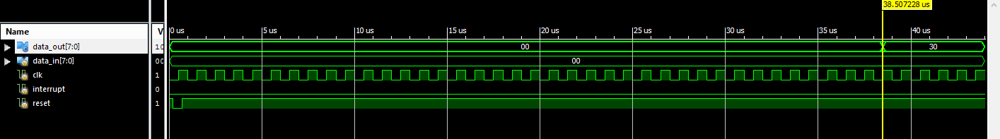

# NTP-microprocessor

* ## Overview
  
  A real time Microprocessor  impemented in verilog and tested on Xilinx Spartan 3E FPGA.
  
  It's a RISC based 8 bit 5 stage pilelined proccessor with 28 bit instruction format and 579.67 Mhz clock frequency.
  
  Individual module implementations for:
  * Instruction Fetch
  * Instruction Decode
  * Execution Block
  * Data Memory Block
  * Write Back Block
  * Dependency Check Block
  * Jump Control Block
  * Stall Control Block
  * Register Bank Block

* ## Specifcations and Features

  * 8-bit Processor.
  * Instruction Size 24-bit.
  * 28 Distinct Instructions.
  * Fixed Instruction Size (24 bits).
  * RISC based architecture.
  * 5 Staged pipelined processor.
  * Maximum Clock Frequency 579.374 MHz.
  * 32 Registers.
  * Ideal CPI = 1.
  * Five types of Instruction format (R, I, J, M and I/O type).
  * Harvard type architecture as there are separate storage blocks and signal pathways are provided for data memory and program memory.
  * Two types of addressing modes register direct mode and register immediate addressing mode.
  * Simpler Architecture.
  * CPI = 1.33333333.
  * Program Memory 768 bytes.
  * Data Memory 256 bytes.
  * 21 pins (data_in 8, data_out 8, clk, reset, Vcc, Ground and Interrupt each)
  
* ## Block Diagram

*Note:- All the modules contain clock (clk) and reset as inputs.*

* ## Simulation Results

  * **Addition**
    
 
  * **Multiplication**
    
    

* ## Comparison of our design with 8085

Our Processer | Intel 8085
------------- | ----------
RISC Based Architecture | Semi CISC Based Architecture
8-bit Address bus | 16-bit Address bus
8-bit CPU | 8-bit CPU
Max Clock frequency 579.374 MHz | Clock frequency 3-6 MHz
5 staged pipelined processor | Single stage non-pipelined processor
21 pins | 40 pins
32 Registers | 6 Registers (B, C, D, E, H, L) and 1 Accumulator
External Memory cannot be added | External memory can be added
Harvard based architecture | Von Neumann based architecture
Fixed Instruction size(24 bits) | Varying Instruction size (8-24 bits)
28 distinct Instructions | 74 distinct instructions
Program memory is 768 bytes and Data Memory is of 256 bytes | Program memory and Data Memory combined is of 65536 bytes
No Accumulator | Contains Accumulator
Only one Interrupt | Five hardware Interrupts
No Stack Pointer | Stack Pointer

