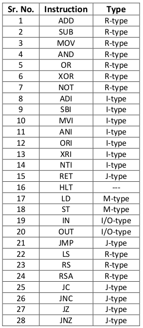
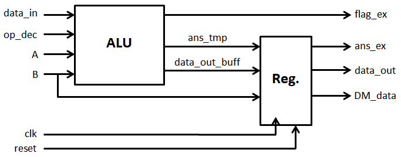
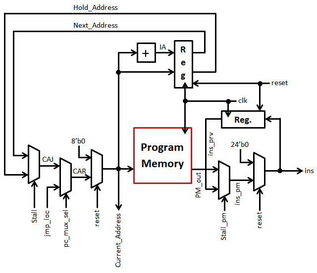
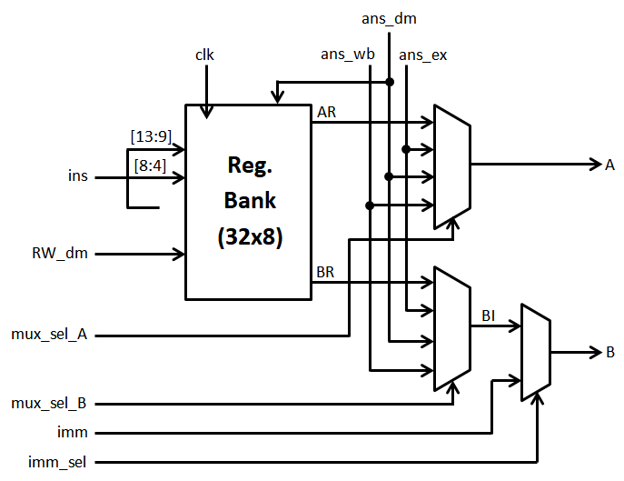
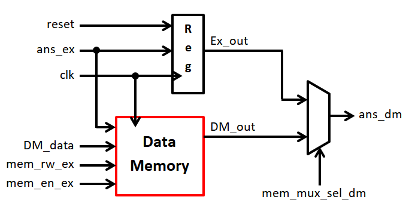
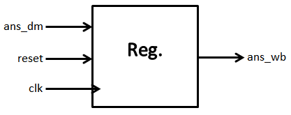
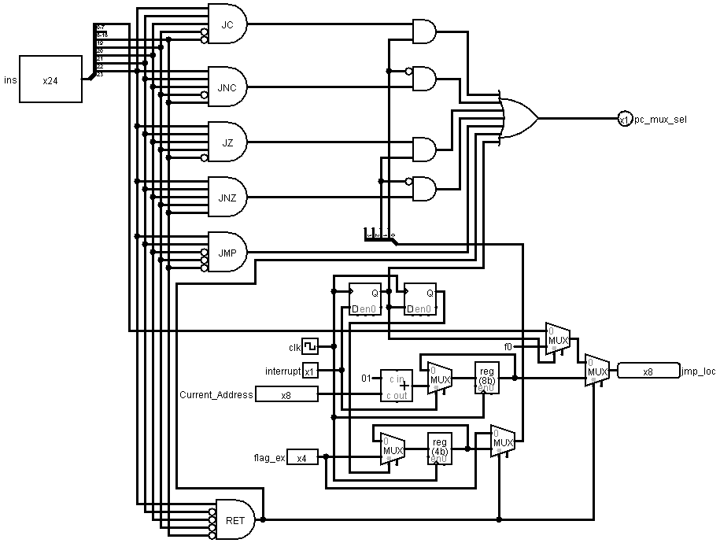
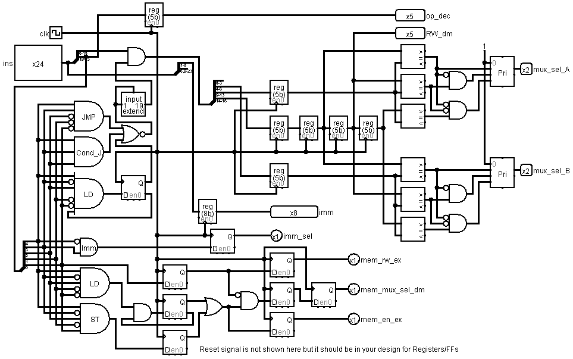

# NTP-microprocessor

* ## Overview
  
  A real time Microprocessor impemented in verilog and tested on Xilinx Artix FPGA.
  
  It's a RISC based 8 bit 5 stage pilelined proccessor with 28 bit instruction format and 579.67 Mhz clock frequency.
  
  Individual module implementations for:
  * Instruction Fetch
  * Instruction Decode
  * Execution Block
  * Data Memory Block
  * Write Back Block
  * Dependency Check Block
  * Jump Control Block
  * Stall Control Block
  * Register Bank Block

* ## Specifcations and Features

  * 8-bit Processor.
  * Instruction Size 24-bit.
  * 28 Distinct Instructions.
  * Fixed Instruction Size (24 bits).
  * RISC based architecture.
  * 5 Staged pipelined processor.
  * Maximum Clock Frequency 579.374 MHz.
  * 32 Registers.
  * Ideal CPI = 1.
  * Five types of Instruction format (R, I, J, M and I/O type).
  * Harvard type architecture as there are separate storage blocks and signal pathways are provided for data memory and program memory.
  * Two types of addressing modes register direct mode and register immediate addressing mode.
  * Simpler Architecture.
  * CPI = 1.33333333.
  * Program Memory 768 bytes.
  * Data Memory 256 bytes.
  * 21 pins (data_in 8, data_out 8, clk, reset, Vcc, Ground and Interrupt each)
  
* ## Block Diagram

*Note:- All the modules contain clock (clk) and reset as inputs.*

* ## How to Use
  * After downloading this repository just run NTP-Microprocessor.xise file.
  * Go to Simulation from the menu shown on top left corner and run Microprocessortb.v file to check simulation results.
  * Or Else upload .bit file on Artix FPGA
  
* In order to write your own assembly code in Assembly_Program.COE in memory_initialization_vector in Hexadecimal format
  **Opcodes and Operations**
  Sr No. | Instruction | Opcode | Operation in Execution Block | Flags Affected | Type
  ------ | ----------- | ------- | ------------ | ------------------------------ | --------
  1 | ADD | 00000 | ans_ex = A + B | Parity, Overflow, Zero, Carry | R-type
  2 | SUB | 00001 | ans_ex = A - B | Parity, Overflow, Zero, Carry | R-type
  3 | MOV | 00010 | ans_ex = B | Parity, Zero (Reset other flags) | R-type
  4 | AND | 00100 | ans_ex = A & B | Parity, Zero (Reset other flags) | R-type
  5 | OR | 00101 | ans_ex = A &#124; B | Parity, Zero (Reset other flags) | R-type
  6 | XOR | 00110 | ans_ex = A ^ B | Parity, Zero (Reset other flags) | R-type
  7 | NOT | 00111 | ans_ex = ~B | Parity, Zero (Reset other flags) | R-type
  8 | ADI | 01000 | ans_ex = A + B | Parity, Overflow, Zero, Carry | I-type
  9 | SBI | 01001 | ans_ex = A - B | Parity, Overflow, Zero, Carry | I-type
  10 | MVI | 01010 | ans_ex = B | Parity, Zero (Reset other flags) | I-type
  11 | ADI | 01100 | ans_ex = A & B | Parity, Zero (Reset other flags) | I-type
  12 | ORI | 01101 | ans_ex = A &#124; B | Parity, Zero (Reset other flags) | I-type
  13 | XRI | 01110 | ans_ex = A ^ B | Parity, Zero (Reset other flags) | I-type
  14 | NTI | 01111 | ans_ex = ~B | Parity, Zero (Reset other flags) | I-type
  15 | RET | 10000 | Hold previous ‘ans_ex’ | Reset all flags | J-type
  16 | HLT | 10001 | Hold previous ‘ans_ex’ | Reset all flags | ---
  17 | LD | 10100 | ans_ex = A | Reset all flags | M-type
  18 | ST | 10101 | ans_ex = A | Reset all flags | M-type
  19 | IN | 10110 | ans_ex = data_in | Parity, Zero (Reset other flags) | I/O-type
  20 | OUT | 10111 | Hold previous ‘ans_ex’ data_out = A | Reset all flags | I/O-type
  21 | JMP | 10101 | Hold previous ‘ans_ex’ | Reset all flags | J-type
  22 | LS | 11001 | ans_ex = A << B | Parity, Zero (Reset other flags) | R-type
  23 | RS | 11010 | ans_ex = A >> B | Parity, Zero (Reset other flags) | R-type
  24 | RSA | 11011 | ans_ex = A >>> B | Parity, Zero (Reset other flags) | R-type
  25 | JC | 11100 | Hold previous ‘ans_ex’ | Reset all flags | J-type
  26 | JNC | 11101 | Hold previous ‘ans_ex’ | Reset all flags | J-type
  27 | JZ | 11110 | Hold previous ‘ans_ex’ | Reset all flags | J-type
  28 | JNZ | 11111 | Hold previous ‘ans_ex’ | Reset all flags | J-type
  
  *Note -: Arithmetic operations are on 2’s complimented numbers.*
  
  

  * ## Simulation Results

  * **Addition**
    
 
  * **Multiplication**
    
    

* ## Comparison of our design with 8085

Our Processer | Intel 8085
------------- | ----------
RISC Based Architecture | Semi CISC Based Architecture
8-bit Address bus | 16-bit Address bus
8-bit CPU | 8-bit CPU
Max Clock frequency 579.374 MHz | Clock frequency 3-6 MHz
5 staged pipelined processor | Single stage non-pipelined processor
21 pins | 40 pins
32 Registers | 6 Registers (B, C, D, E, H, L) and 1 Accumulator
External Memory cannot be added | External memory can be added
Harvard based architecture | Von Neumann based architecture
Fixed Instruction size(24 bits) | Varying Instruction size (8-24 bits)
28 distinct Instructions | 74 distinct instructions
Program memory is 768 bytes and Data Memory is of 256 bytes | Program memory and Data Memory combined is of 65536 bytes
No Accumulator | Contains Accumulator
Only one Interrupt | Five hardware Interrupts
No Stack Pointer | Stack Pointer

* ## Execution Block

* ## Program Memory

* ## Register Bank

* ## Data Memory

* ## Stall Control

* ## Write Back

* ## Jump Control

* ## Dependency Check

